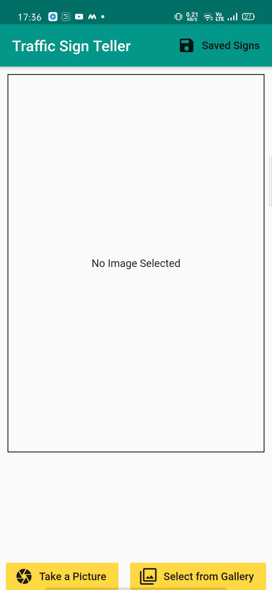

# Traffic-Sign-Teller-App
An app made with Flutter and Dart that can recognize upto 43 different road signs. Api used for detection is custom api deployed via using Heroku. 

Screenshots:

### Base Screen

### Screen after selection of file via using camera or Gallery
	

### Result of prediction
Note: Since there is been a api call, there can be little bit of delay in getting result and since i have not and loading screen, so you stay on the base screen. Will fix this issue in near future.

