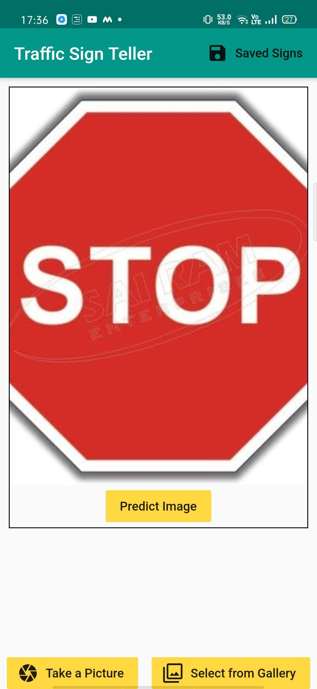
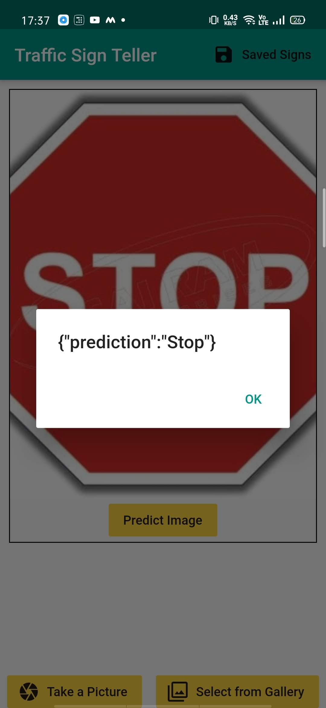

# Traffic-Sign-Teller-App
An app made with Flutter and Dart that can recognize upto 43 different road signs. Api used for detection is custom api deployed via using Heroku. 

A web version of this app is also present.
If you wanna check this out, You can go to this link below
### [Traffic Sign Teller](http://trafficapp.chiragsaini.works/)

Screenshots:

### Base Screen

### Screen after selection of file via using camera or Gallery

### Result of prediction
Note: Since there is been a api call, there can be little bit of delay in getting result and since i have not configured a loading screen, so you stay on the base screen. Will fix this issue in near future.

